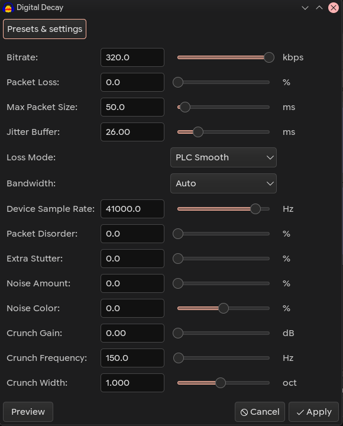

### Digital Decay (Audacity Nyquist Plugin)

An experimental digital degradation and network transport simulator. Digital Decay is designed to destroy, mangle, and compress audio, emulating the harsh artifacts of early internet streams, broken codecs, and cheap digital hardware (like old flip-phone cameras or low-grade ADCs). 

### Overview
Built with plunderphonics aesthetics in mind, Digital Decay goes beyond standard bitcrushers. It dynamically simulates how digital audio breaks down when packets are lost in transit, when a codec is starved of data, or when a microphone capsule is overloaded. 

---

### Preview:
Original "Everyday things" by The Patients:

https://github.com/user-attachments/assets/76f4e1e0-41bc-4c71-a6bc-e42aeb369625

Digital Decay (low bitrate):

https://github.com/user-attachments/assets/a465248c-c05a-4a5b-834b-4edb181361de

Digital Decay (DESTROY!):

https://github.com/user-attachments/assets/7b9c2f18-5fbc-4ba3-8a78-9c2dcc184e15

---

### Key Features:
* **True Codec Starvation:** Injects colored noise *before* the MP3 compression algorithm, forcing the codec to choke and generate unpredictable artifacts.
* **Network Datamoshing:** Simulates real-time packet loss, jitter, and packet disorder with anti-click microfades for smooth, glitchy textures.
* **Hardware Decimation:** A custom sample-rate reduction engine that forces harsh digital aliasing (hardware-style decimation).
* **Dynamic Crunch (Choke):** An envelope-followed EQ/Saturator that makes the audio dynamically "duck" and choke when hitting specific frequencies.

---

### Installation

1. [Download](https://github.com/LicaRedMoth/digital-decay/blob/main/digital-delay.ny) the `digital-delay.ny` file.
2. Open Audacity.
3. Go to **Tools -> Nyquist Plugin Installer**.
4. Select the downloaded file and click **Open**.
5. Restart Audacity or check the **Effect** menu for **Digital Decay**.

---

### Controls Breakdown

#### Main Codec & Transport Settings
* **Bitrate (kbps):** The core compression quality. Drop this down to 2.0 - 8.0 kbps for extreme underwater/granular MP3 artifacts.
* **Packet Loss (%):** The probability of a network packet dropping out entirely.
* **Max Packet Size (ms):** Determines the maximum length of the audio chunks being processed and dropped/stuttered.
* **Jitter Buffer (ms):** Simulates network delay fluctuations, causing the audio to drift slightly out of sync.
* **Loss Mode:** Dictates what happens when a packet is lost:
  * *Silence:* Drops the audio to 0.
  * *PLC Smooth:* Packet Loss Concealment (fades out gracefully).
  * *Repeat:* Freezes and repeats the last known buffer (robotic stutter).
  * *Random:* Randomizes between the above modes.
* **Bandwidth:** Artificial frequency limiting (Low-pass) applied during the encoding process.
* **Device Sample Rate (Hz):** True decimation. Lowers the sample rate by dropping samples (aliasing), perfectly emulating old digital dictaphones and early phone cameras.
* **Packet Disorder (%):** Scrambles the chronological order of the audio packets.
* **Extra Stutter (%):** Forces random buffer repeats independent of packet loss.

#### Noise & Saturation (Hardware Emulation)
* **Noise Amount (%):** Injects noise into the signal *before* compression. High amounts cause the codec to aggressively artifact.
* **Noise Color (%):** Tonal balance of the noise. Negative values yield a dark, tape-like rumble; positive values yield a sharp, blue digital hiss.
* **Crunch Gain (dB):** Boosts a specific frequency into a dynamic clipper (max 12dB).
* **Crunch Frequency (Hz):** The target frequency for the Crunch overdriver.
* **Crunch Width (oct):** The bandwidth (Q-factor) of the Crunch EQ.
* **Payload Crush (%):** Probability of the digital payload losing its bit resolution.
* **Crush Resolution (bits):** The bit-depth used when Payload Crush is triggered.
* **Dry / Wet Mix (%):** Blends the destroyed signal with the clean original audio.

---

### License

This project is licensed under the MIT License — see the [LICENSE](LICENSE) file for details.

### Credits

Developed by [RedMoth](https://github.com/LicaRedMoth) in collaboration with [Gemini (Google AI)](https://gemini.google.com).
